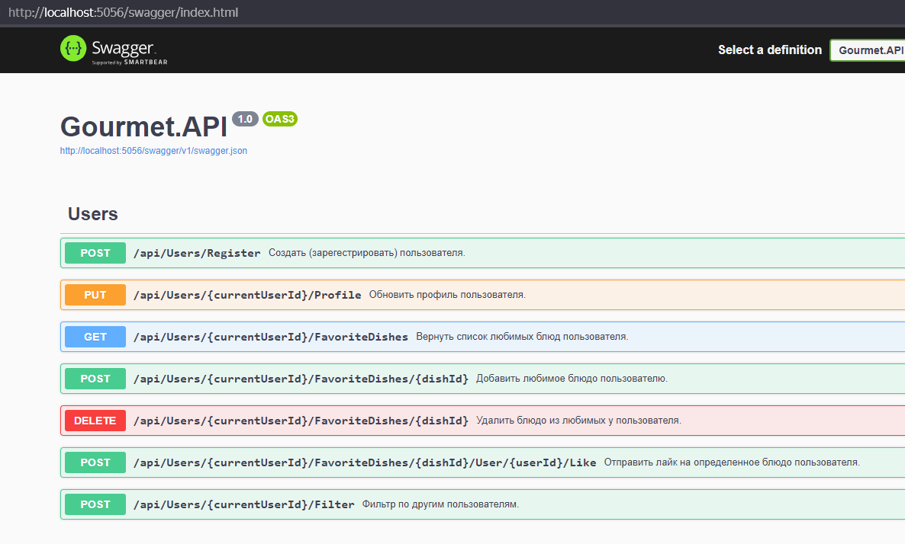

# Тестовое задание.
Написать дейтинг-приложение, которое будет объединять пользователей по любимой еде. 
Вам требуется разработать часть функционала API для данного приложения.

### Стэк:

- NET Core WebApi
- MS SQL Server

### Задание:

Что должно входить в это тестовое:
- API c функционалом;
- документация на ваш выбор;
- хотя бы unit 1 тест с использованием бд в памяти.

Важно обращать внимание на архитектуру и чистоту кода.

Пользователь должен иметь возможность:
- зарегистрироваться в данном приложении (любым способом на ваш выбор);
- добавить или обновить свое имя, гендер, возраст и список любимых блюд;
- просматривать других пользователей, фильтруя их по гендеру (обязательно), возрасту (обязательно) и списку блюд (опционально). В выдаче показывается гендер, возраст и список любимых блюд;
- отправить лайк на определенное блюдо пользователя. (в будущем доработка этого функционала продолжится чтением лайков);

# Реализация.

Приложение названо "Гурман" (Gourmet).

Реализован API:

Проект "Гурман" реализован с использованием чистой Clean (луковой/гексагональной) архитектуры.
##### Clean Architecture

Где
- API - это внешний слой, представляет собой ASP.NET Core WebAPI проект "Gourmet.API";
- Infrastructure - внешний слой инфраструктуры, проект "Gourmet.Infrastructure". Тут находятся репозитории работы с БД;
- Application - второй слой, проект "Gourmet.Application", содержит варианты использования, определяющие порядок взаимодействия между пользователями и сущностями;
- Domain Model - уровень модели предметной области, проект "Gourmet.Domain", бизнес-правила, здесь контролируется и используется состояние. 

##### CQRS
Используется паттерн CQRS для разделения интерфейса уровня инфраструктуры на репозиторий команд и репозиторий запросов.
Commands/Queries используют паттерн посредник для слабой связанности между слоями сервиса с помощью библиотеки MediatR.

#### Регистрация
Пункт задания:
- Зарегистрироваться в данном приложении (любым способом на ваш выбор);

Аутентификация и авторизация пользователя в системе были мной опущены, поскольку, на мой взгляд чрезмерно усложняют исполнение тестового задания.
Регистрация пользователя заменена методом создания пользователя:
- POST /api/Users/Register Создать (зарегестрировать) пользователя;

и параметром currentUserId, который есть в каждом url запроса, который содержит идентификатор пользователя от имени которого отправляется запрос.

## Как запустить приложение. How to run application
Для запуска проекта на Вашем ПК полжно быть установлен SQL Server Express - ядро LocalDB.

| MS SQL |  |
| ------ | ------ |
| Имя сервера | (localdb)\MSSQLLocalDB |

После запуска приложения, будет произведено поблючение к БД, создана в ней база "Gourmet" и наполнена тестовыми данными.

Приложение будет доступно по URL:
|  | URI |
| ------ | ------ |
| WebAPI | http://localhost:5056/swagger/index.html |